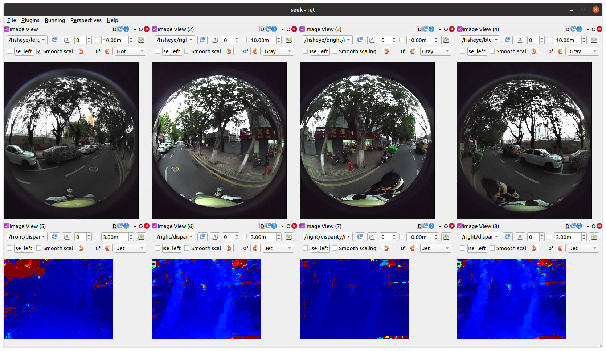
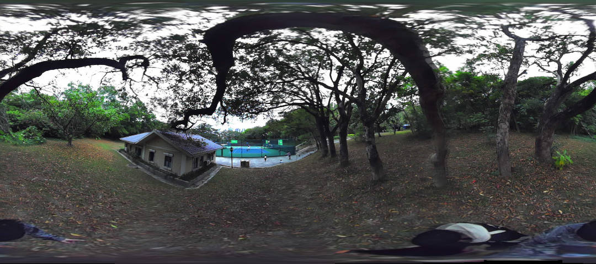
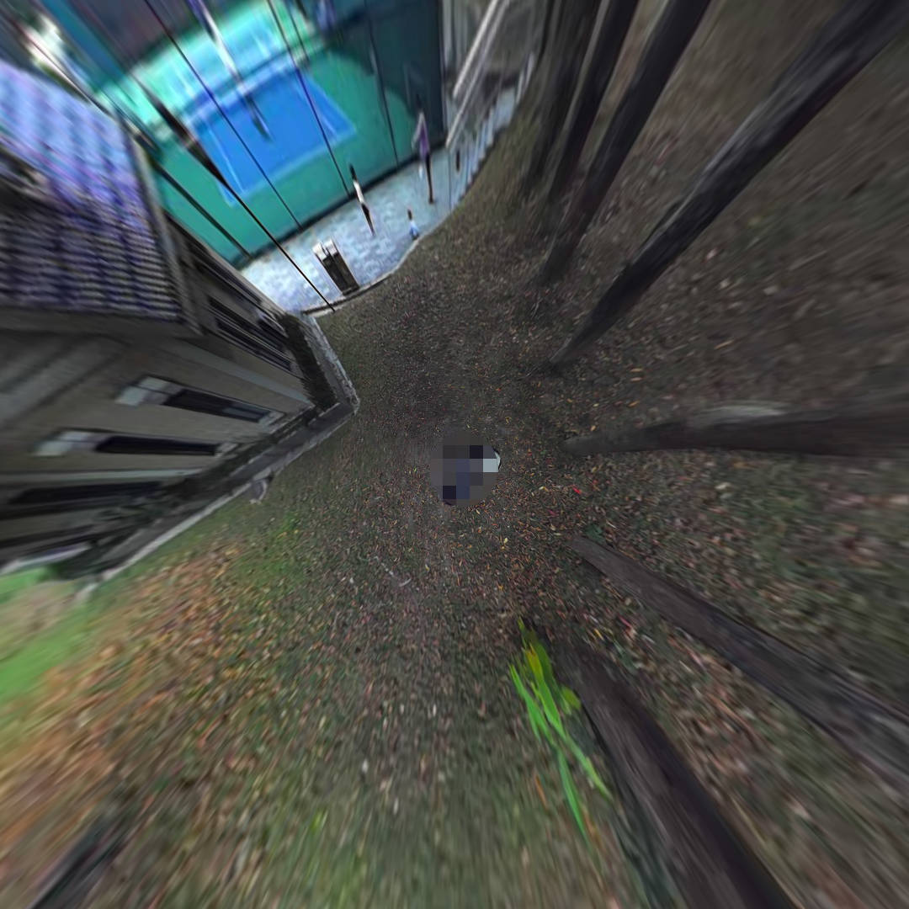
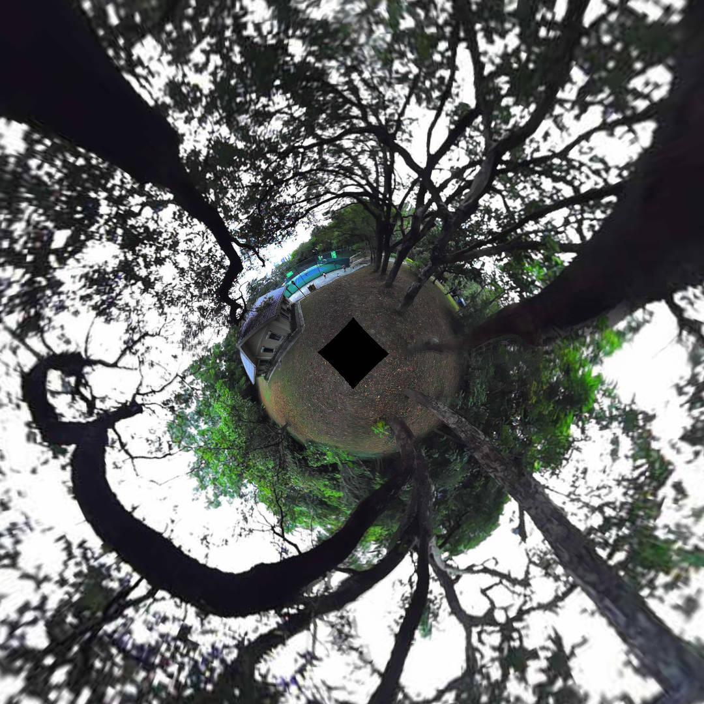
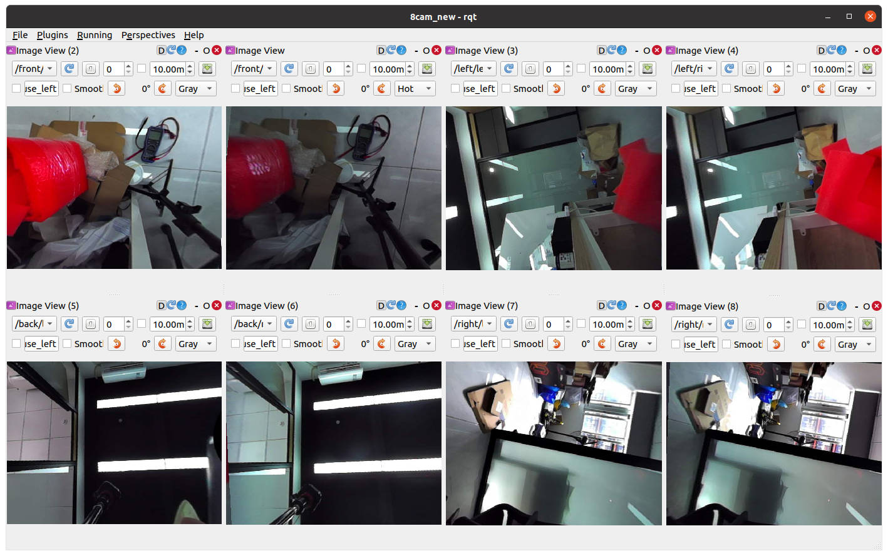
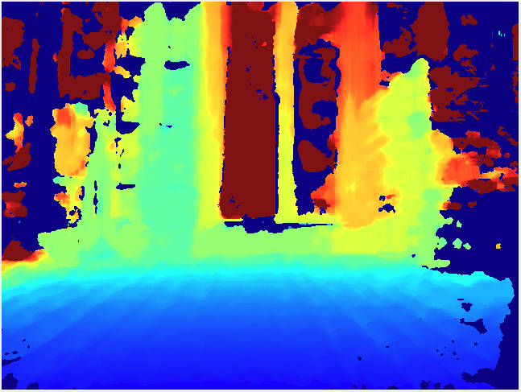
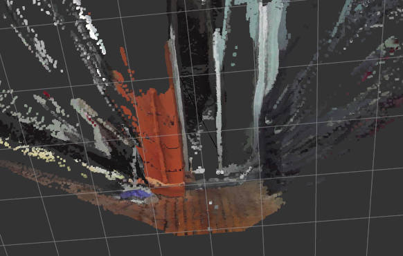

## 售后支持请添加微信

微信号：ShiYuan_Seeker

  


深圳市视元智能科技有限公司 Seeker Series ROS SDK

A development kit designed for Seeker series cameras, supporting multimodal data acquisition and processing in ROS1 Noetic environment.

## 📦 installation guide

### Environmental requirements

+ **Ubuntu 20.04**
+ **ROS Noetic** ([Installation Tutorial](http://wiki.ros.org/noetic/Installation/Ubuntu))
+ sudo apt install libusb-1.0-0-dev
+ pip3 install pyusb numpy ruamel.yaml

### Installation steps

1. **Create workspace**：

mkdir -p ~/catkin_ws/src

2. **Clone Project Warehouse**：

cd ~/catkin_ws/src && git clone http://gitee.com/nochain/seeker1.git

Add code for converting disparity to depth map

git clone [https://github.com/skohlbr/disparity_image_proc.git](https://github.com/skohlbr/disparity_image_proc.git)

3. **Compile Project**：

catkin_make -DCMAKE_BUILD_TYPE=Release

4. **Set environment variables**

source ~/catkin_ws/devel/setup.bash

或者：echo "source ~/catkin_ws/devel/setup.bash" >> ~/.bashrc

5. **Install undistortion package**

dpkg -i  ~/catkin_ws/src/seeker1/deb/ros-noetic-image-undistort_0.0.0-0focal_amd64.deb

## 🔌 Hardware connection

1. Connect the device using a USB 3.0 Type-C cable
2. Set device permissions to sudo vim /etc/udev/rules.d/99-seeker.rules, add udev rules

```plain
SUBSYSTEM=="usb", ATTR{idVendor}=="2207", ATTR{idProduct}=="0000", MODE="0666"
```

‌**Reload udev rules**‌

```bash
sudo udevadm control --reload && sudo udevadm trigger
```

**Then plug and unplug the device**

## 🚀 Quick start

Basic data stream (fisheye image+IMU+disparity map)

```bash
roslaunch seeker 1seeker_nodelet.launch
```

## Preparation before running other routines: (reading calibration parameters)

Ensure that the module can be used normally and there are no issues with USB access permissions. Execute the following command to read calibration parameters from the module and generate a configuration file:

```bash
python3 ~/catkin_ws/src/seeker/scripts/1get_kalibr_info.py
```

+ ‌**Output file path**：The generated calibration parameter file is saved by default to `/tmp/kalibr_cam_chain.yaml`

### 3.3.3. Configuration file deployment

Copy the generated calibration file to the target configuration directory:

```plain
cp /tmp/kalibr_cam_chain.yaml ~/catkin_ws/src/seeker/config/seeker_omni_depth/
```

+ ‌**Dependency Relationship**：Subsequent splicing, distortion resolution, and other processes need to be initialized with parameters based on this file.

## 📂 Launch file description

### Image viewing

```bash
#Start the basic data stream (fisheye image+disparity map+IMU)
roslaunch seeker 1seeker_nodelet.launch  
```

**rqt_gui import**

Rosrun rqt_gui rqt_gui, then click import in perspectives to import all gui files of ~/catkinw_s/src/seeker/gui one by one. Then perspectives selects the seeker. View the original image and disparity map.



### Panoramic stitching

**Run**

```plain
roslaunch seeker 2concat_nodelet.launch concat_method:=3
Note that the image will only appear after a few seconds of activation
The topic is /concat_undistort_node/image
You can use rqt_image_view to view it
```

**Effect**

concat_method:=0

A 360 degree panoramic image with simple stitching



concat_method:= 1 Fusion Splicing BEV Diagram

(blend_height) Fusion weight values, adjust range (from 0.7 to 0) (bev_ground_feight) The height of the ground relative to the module, for example (-1.0 meters) set to (-1.0) (bev_fx) virtual camera focal length


concat_method:= 2 Fusion Splicing 360 Panorama Images

 

(blend_weight) Fusion weight values, adjust range (from 0.7 to 0) (panoruadius) radius size
concat_method:= 3 Fusion Splicing 720 Panoramic View

 

(blend_weight) Fusion weight values, adjust range (from 0.7 to 0) (panoruadius) radius size

### Image distortion resolution


### Image undistortion

**Run**

```bash
roslaunch seeker 3undistort_nodelet.launch
```

**View rqt_gui**

Rosrun rqt_gui rqt_gui and then perspectives select undistort. View the distorted image.

**Effect**

### Depth map

```plain
roslaunch seeker 4depth_image.launch
```

Then you can view the following four topics:

| /front/depth/image_raw |
| --- |
| /right/depth/image_raw |
| /back/depth/image_raw |
| /left/depth/image_raw |




### Point Cloud

```plain
roslaunch seeker 5point_cloud.launch
```

View with rviz:

To view the topic/front/points2, adjust the Fixed Frame to/depth0

To view the topic/right/points2, adjust the Fixed Frame to/depth1

To view the topic/pack/points2, adjust the Fixed Frame to/depth2

To view the topic/left/points2, adjust the Fixed Frame to/depth3



> _@深圳市视元智能科技有限公司_
>

## 售后支持请添加微信

微信号：ShiYuan_Seeker

